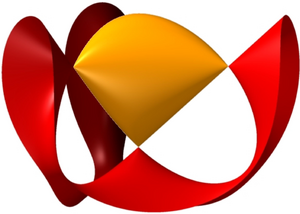

<!-- Logo (with link) -->

  

<!-- Title -->
<h1 align="center">
  Personal Site
</h1>

<!-- Badges (with link) -->

  
  

<!-- Small description -->

A personal site.

<!-- Screenshot or video (with link) -->

  

⚠️ *Work in Progress* ⚠️

<!-- Credits -->
## Credits

- [Gilles Castel](https://github.com/gillescastel) and his post [How I'm able to take notes in mathematics lectures using LaTeX and Vim](https://castel.dev/post/lecture-notes-1/) helped me a lot with taking maths lecture notes in $\LaTeX$. His site also inspired some of my own site's styling choices.
- [Adam Kelly](https://github.com/ak2316-cam) and his [site](http://ak2316.user.srcf.net/) on which this site is based. Moreover, my lecture notes template is almost entirely based on his $\LaTeX$ style files.
